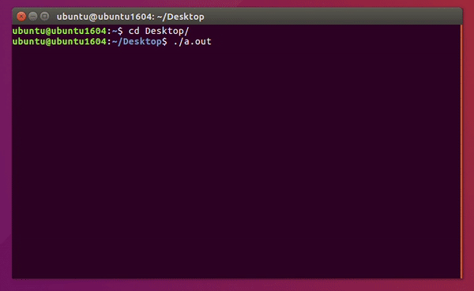

# Custom syscall in linux kernel

Operating systems project

* [About the Project](#about-the-project)
  * [General process of linux boot](#general-process-of-linux-boot)
  * [Understanding the process behind a syscall](#understanding-the-process-behind-a-syscall)
    * [Conceptual diagram](#conceptual-diagram)
    * [Memory management](#memory-management)
* [Getting Started](#getting-started)
  * [Prerequisites](#prerequisites)
  * [Steps to implement](#steps-to-implement)
* [Usage](#usage)
* [Detailed Explanations](#detailed-explanations)
* [References](#references)

## About the Project

This project is aimed to cover the following features:

1. Develop a function that determines if an arithmetic expression is found correctly closed. The function should return true if the expression is correctly closed and false otherwise

    <i> It is understood by closed the fact that each symbol of parentheses and / or open bracket must have its corresponding closing. Example (5 + 5), [(1 + 1) * (2 + 2)], (((([1])))) </i>

2. This function must be implemented in a system call that must receive as a parameter a pointer to the string containing the expression

3. The student must use C++ (or C) and the Linux kernel to add the system call

4. You will need to compile the operating system kernel to add the custom system call

5. You must create a program that receives as command line input the string to use and make use of the system call implemented in the operating system

**For further reference, we included the files we manipulated (in their respective directories) to compile the linux kernel**

### General process of linux boot

There are 5 main components:

1. BIOS: When you turn on your machine, this program executes a hardware check; it also loads the operating system

2. Boot Loader

    a. MRB: Loads and executes GRUB

    b. GRUB: Allows you to choose the kernel image and it executes it

3. Kernel: Mounts the file system specifie3d in the GRUB; this file is compressed

4. Init: Decompress the kernel

5. Runlevel: Loads the file system and finishes the boot

### Understanding the process behind a syscall

#### **Conceptual diagram**


#### **Memory management**

Linux memory management subsystem is responsible, as the name implies, for managing the memory in the system. Dealing directly with physical memory is quite complex and to avoid this complexity a concept of virtual memory was developed.

The virtual memory abstracts the details of physical memory from the application software and with virtual memory, each memory access uses a virtual address.

Since the physical system memory is divided into page frames, or pages, every physical memory page can be mapped as one or more virtual pages. These mappings are described by page tables that allow translation from a virtual address used by programs to the physical memory address and you can access them with a pointer that is in a register.


## Getting Started

### Prerequisites

* Ubuntu (64 bit) system

<i> In this project we used [Ubuntu VM (Virtualbox)](https://www.linuxvmimages.com/images/ubuntu-1604/)</i>

### Steps to implement

<i> <strong>Tip: </strong> type sudo -s in your terminal before executing the upcoming commands so you will have a super user terminal session</i>

0. Type ```uname -r``` to know your current kernel version. Remember this information because you'll use it to compare to the installed one

1. Download kernel source

    ```sh
    wget https://www.kernel.org/pub/linux/kernel/v4.x/linux-4.17.4.tar.xz
    ```

2. Extract the kernel source code

    ```sh
    sudo tar -xvf linux-4.17.4.tar.xz -C/usr/src/
    ```

    <i>
    tar: stores and extracts files from a tape or disk archive

    -x: extract files from an archive

    -v: requested using the –verbose option, when extracting archives

    -f: file archive; use archive file or device archive

    -C: extract to the directory specified after it.(in this case /usr/src/)
    </i>

    Switch to directory

    ```sh
    cd /usr/src/linux-4.17.4/
    ```

3. Define a new system call

    a. Create a directory named balancedp/ and change the directory to balancedp/:

    ```sh
    mkdir balancedp
    cd balancedp
    ```

    b. Create a file balancedp.c

    ```sh
    gedit balancedp.c
    ```

    c. Write the following code:

    ```c
    #include <linux/kernel.h>
    #include <linux/linkage.h>
    #include <linux/syscalls.h>

    int areBracketsBalanced(char *s);

    SYSCALL_DEFINE1(balancedp, char *, src)
    {
            printk("%s\n", src);
        printk("Memory address of input %p\n", &src);
        
        if (areBracketsBalanced(src)) 
            printk("Balanced \n"); 
        else
            printk("Not Balanced \n"); 
            return 0;
    }

    int areBracketsBalanced(char *s) 
    { 
    char *q=s;
    char *p;
    for (p=s; *p; p++) 
        switch(*p) {
        case '(': *q++ = ')'; continue;
        case '{': *q++ = '}'; continue;
        case '[': *q++ = ']'; continue;
        case '0': continue; 
        case '1': continue; 
        case '2': continue; 
        case '3': continue; 
        case '4': continue; 
        case '5': continue; 
        case '6': continue; 
        case '7': continue; 
        case '8': continue; 
        case '9': continue; 
        case '+': continue; 
        case '*': continue; 
        case '-': continue; 
        case '/': continue; 
        default: if (q==s || *p != *--q) return 0;
        }
    
    return q==s;
    }
    ```

    <i> To understand better about this syscall macro you can check the [detailed explanations](#detailed-explanations) section </i>

    d. Create a “Makefile” in the balancedp directory:

    ```sh
    gedit Makefile
    ```

    e. Add the following line to it:

    ```Makefile
    obj-y := balancedp.o
    ```

    <i> This is to ensure that the balancedp.c file is compiled and included in the kernel source code </i>

4. Adding balancedp/ to the kernel's Makefile:

    a. Go to parent dir (``` cd ../ ```) and open "Makefile"

    ```sh
    gedit Makefile
    ```

    Search for core-y in the document, you’ll find this line as the second instance of your search:

    ```Makefile
    core-y += kernel/ mm/ fs/ ipc/ security/ crypto/ block/
    ```

    Add "balancedp/" to the end of this line:

    ```Makefile
    core-y += kernel/ mm/ fs/ ipc/ security/ crypto/ block/ balancedp/
    ```

    <i> This is to tell the compiler that the source files of our new system call (sys_balancedp()) are in present in the balancedp directory </i>

5. Add the new system call to the system call table:

    a. Go to directory inside linux-4.17.4/:

    ```sh
    cd arch/x86/entry/syscalls/
    ```

    Edit the table

    ```sh
    gedit syscall_64.tbl
    ```

    b. Go to the last line of the first chunk and write:

    ```tbl
    333       64        balancedp          __x64_sys_balancedp
    ```

    <i> 

    * We wrote 333 because in the previous line the number entry was 332. This number it will be used in later steps
    * We wrote 64 because our system is 64 bit
    * The third column indicates the name of the syscall
    * The last column refers to the entrypoint

    </i>

6. Add new system call to the system call header file:

    a. Go to the linux-4.17.4/ directory and type:

    ```sh
    cd include/linux/
    gedit syscalls.h
    ```

    b. Add the following line to the end of the document before the #endif statement:

    ```h
    asmlinkage long sys_balancedp(char *);
    ```

    <i> This defines the prototype of the function of our system call. "asmlinkage" is a key word used to indicate that all parameters of the function would be available on the stack. </i>

7. Compile the kernel:

    a. Install necessary packages

    ```sh
    apt-get install gcc
    apt-get install libncurses5-dev
    apt-get install bison
    apt-get install flex
    apt-get install libssl-dev
    apt-get install libelf-dev
    apt-get update
    apt-get upgrade
    ```

    b. To configure your kernel use the following command in your linux-4.17.4/ directory:

    ```sh
    make menuconfig
    ```

    <i> You will get a pop up window with the list of menus and you can select the items for the new configuration. If your unfamiliar with the configuration just check for the file systems menu and check whether “ext4” is chosen or not, if not select it and save the configuration. </i>

    c. Compile the kernel

    ```sh
    make
    ```

8. Install / update Kernel:

    a. Run the following command in your terminal:

    ```sh
    make modules_install install
    ```

    b. To update the kernel in your system you will need to reboot

    ```sh
    shutdown -r now
    ```

    After rebooting you can verify the kernel version:

    ```sh
    uname -r
    ```

    You can compare it to the one you saw before and it must be different

## Usage

1. Go to any directory and create a <file_name>.c file

    <i> To keep simpicity we did it in the Desktop and we named the file "test.c" </i>

2. Write the following code in the file:

    ```c
    #define _GNU_SOURCE
    #include <unistd.h>
    #include <stdio.h>
    #include <stdlib.h>
    #include <errno.h>
    #include <sys/syscall.h>
    #include <string.h>

    int main(void){
        
        char st[256];

        printf("Enter an arithmetic operation: ");
        gets(st);

        printf("Memory address of input (outside syscall): %p\n", &st);
        
        long sta = syscall(333, st);  

        printf("return value from syscall: %ld\n", sta);    
        return 0;
    }
    ```

3. Compile and run the program:

    ```sh
    gcc <file_name>.c
    ./a.out
    ```

    Enter an expression to check parentheses. The address of the input you entered will be displayed as well as the return of the program

4. Check the message of your kernel run:

    ```sh
    dmesg
    ```

    This will display the input you entered before and the address that the kernel used to handle it. Down below you will see if your input has balanced parentheses or not

    

## Detailed Explanations

### SYSCALL_DEFINEn

The purpose of macros is to ensure that the proper compiler pragmas<sup>1</sup> are applied to the function

It's syntax is:

SYSCALL_DEFINEn(name_of_the_syscall, type_of_argument1, name_of_argument1, type_of_argument2, name_of_argument2, ...)

<i>n stands for the number of arguments the syscall is going to receive</i>

This macro generates two functions:

a. SYSCALL_METADATA()
Basic tracer to catch the syscall entry and exit events. Builds a boilerplate function to receive the arguments and match their types

b. __SYSCALL_DEFINEx()
It involves another read function and also implements several instances to validate the types of the entered arguments

<i> <sup>1</sup> In computer programming, a directive or pragma (from "pragmatic") is a language construct that specifies how a compiler (or other translator) should process its input.</i>

## References

* [Adding a Hello World System Call to Linux Kernel](https://medium.com/anubhav-shrimal/adding-a-hello-world-system-call-to-linux-kernel-dad32875872)
* [Adding a syscall to Linux 4.7](https://tejom.github.io/linux/programing/2016/08/06/adding-a-syscall.html)
* [Anatomy of a syscall, part 1](https://lwn.net/Articles/604287/)
* [Memory management in Linux: concepts overview](https://www.kernel.org/doc/html/latest/admin-guide/mm/concepts.html)
